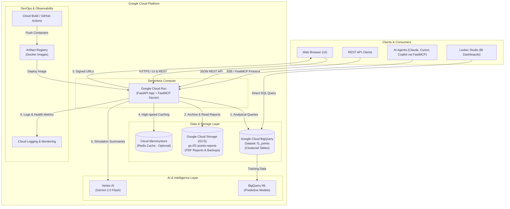

# Google Cloud Platform (GCP) Architecture & Role Guide

This document details the architectural role of **Google Cloud Platform (GCP)** in the Formula 1 Points Application. It explains why each service was chosen, how it integrates with the codebase, the security and authentication model, and how to verify cloud services locally and in production.

---

## 1. Executive Summary & Architectural Role

The Formula 1 Points Application is designed as a cloud-native, serverless analytics platform. While the system can run 100% locally with zero configuration using seed CSVs and local caches, connecting Google Cloud transforms it into an enterprise-ready, globally accessible analytics engine:

- **Analytical Data Warehouse**: Replaces static CSV files with **Google Cloud BigQuery** for scalable, clustered analytical querying of 75+ years of historical Formula 1 data.
- **Durable Object Storage**: Overcomes ephemeral serverless container storage with **Google Cloud Storage (GCS)**, retaining generated PDF season reports and serving them via time-limited v4 Signed URLs.
- **Serverless Compute**: Runs containerized FastAPI and FastMCP endpoints on **Cloud Run**, scaling to zero when idle and rapidly handling traffic spikes.
- **Next-Gen AI Summaries**: Leverages **Vertex AI (Gemini 2.0 Flash)** to generate season narrative analyses in ~1.5 seconds instead of ~45 seconds on local GPUs.
- **Automated CI/CD**: Builds and tags container images via **Artifact Registry** and **Cloud Build** / GitHub Actions.

---

## 2. High-Level GCP Architecture Diagram



---

## 3. GCP Services & Their Specific Roles

### 3.1. Google Cloud BigQuery (Analytical Data Warehouse)

**Source Code Reference**: [`main.py`](main.py) (`_load_from_bigquery`, `_load_data_cached`), [`scripts/seed_bigquery.py`](scripts/seed_bigquery.py)

#### Role & Capabilities:
BigQuery acts as the serverless relational and analytical source of truth for the application.

1. **High-Performance Columnar Storage**:
   - F1 historical data spans 75+ years, 1,100+ Grands Prix, and 26,000+ driver results. BigQuery's columnar execution engine allows aggregation, filtering, and joining in milliseconds.
2. **Table Clustering**:
   Tables seeded by `scripts/seed_bigquery.py` are explicitly clustered on high-cardinality join columns:
   - `results`: Clustered by `[raceId, driverId, constructorId]`
   - `races`: Clustered by `[year, circuitId]`
   - `drivers`: Clustered by `[driverId]`
   - `seasons`: Clustered by `[year]`
   - `constructors`: Clustered by `[constructorId]`
   - `driver_standings`: Clustered by `[raceId, driverId]`
   Clustering reduces data scanned during queries, keeping queries fast and virtually free within the BigQuery free tier (1 TB queries/month free).
3. **Resilient Data Fallback Hierarchy**:
   The application implements a 3-tier fallback sequence in `_load_data_cached()`:
   ```
   [1. BigQuery] ──(if unconfigured or fails)──> [2. SQL DB (MySQL/PostgreSQL)] ──(if unconfigured)──> [3. Seed CSVs]
   ```
   This ensures developer environments and CI tests never fail even without cloud access.
4. **BI & Analytics Integration**:
   Because the datasets reside in BigQuery, users can connect **Looker Studio** directly to `f1_points.results` to create interactive live dashboards without writing backend code.

---

### 3.2. Google Cloud Storage (GCS) (Persistent Artifact Store)

**Source Code Reference**: [`gcs_storage.py`](gcs_storage.py), [`scripts/sync_gcs.py`](scripts/sync_gcs.py), [`main.py`](main.py)

#### Role & Capabilities:
In cloud serverless environments such as Cloud Run, container filesystems are **ephemeral** (tmpfs in memory). Any file written locally vanishes as soon as the instance scales down or restarts.

1. **Permanent PDF Report Retention**:
   When a season simulation runs (`POST /api/simulate-season`), the generated analytical PDF report is uploaded directly to `gs://<GCS_BUCKET_NAME>/season_reports/`.
2. **Report Deduplication & Caching**:
   Before generating a computationally heavy report with LLM summaries and charts, `get_season_report_bytes()` checks GCS. If the report for that season and scoring system already exists, it is served immediately from GCS cache.
3. **Secure v4 Signed URLs**:
   Rather than streaming large PDF binaries through the web application container (consuming container memory and bandwidth), `GET /api/reports/{filename}/url` generates a time-limited **v4 Signed URL** (default 60-minute expiration). The user's browser downloads the PDF directly from Google Cloud Storage's global edge network.
4. **Raw Dataset Backups**:
   `scripts/sync_gcs.py --upload-datasets` backs up all raw CSV datasets to `gs://<GCS_BUCKET_NAME>/datasets/`, providing off-site recovery.

---

### 3.3. Google Cloud Run (Serverless Application Runtime)

**Source Code Reference**: [`Dockerfile`](Dockerfile), [`.github/workflows/deploy.yml`](.github/workflows/deploy.yml)

#### Role & Capabilities:
Cloud Run hosts the containerized FastAPI web application and FastMCP protocol endpoints.

1. **Scale-to-Zero Efficiency**:
   When no traffic is arriving, instances scale to zero, resulting in zero compute charges. When traffic arrives, instances spin up in under 2 seconds.
2. **Seamless Concurrency**:
   Handles high concurrency with multiple requests per container instance, ideal for asynchronous FastAPI endpoints.
3. **Health Check Probes**:
   Integrates directly with the application's health module:
   - Liveness Probe: `GET /health` (confirms process is responsive)
   - Readiness Probe: `GET /health/ready` (confirms BigQuery/Database and GCS connectivity before accepting user traffic)

---

### 3.4. Vertex AI & Gemini (Season Simulation Intelligence)

**Source Code Reference**: [`season_simulator.py`](season_simulator.py), [`SETUP_AI_FEATURE.md`](SETUP_AI_FEATURE.md)

#### Role & Capabilities:
1. **Serverless LLM Inference**:
   Replaces heavy local GPU requirements (e.g., local Ollama `llama3.1:8b` needing 8GB+ VRAM or a $200+/mo GPU cloud instance).
2. **Near Real-Time Latency**:
   Google's **Gemini 2.0 Flash** processes full season summaries in **~1.5 seconds** (versus ~45 seconds on local CPU/GPU).
3. **Pay-Per-Token Pricing**:
   Eliminates continuous idle VM costs; simulations cost fractions of a cent per execution.

---

### 3.5. Artifact Registry & Cloud Build (CI/CD Pipeline)

**Source Code Reference**: [`.github/workflows/deploy.yml`](.github/workflows/deploy.yml)

#### Role & Capabilities:
1. **Secure Container Registry**:
   Docker images built from the repository are stored in Google Cloud Artifact Registry (`<region>-docker.pkg.dev/<project>/<repo>`).
2. **Automated Continuous Deployment**:
   Pushing to the `main` branch triggers GitHub Actions or Cloud Build to:
   - Run unit and integration tests (`pytest`).
   - Authenticate to GCP using Workload Identity Federation (no long-lived keys).
   - Build and push the container image.
   - Deploy the new revision to Cloud Run with zero downtime.

---

## 4. Security, IAM & Authentication Model

The application follows the **Principle of Least Privilege (PoLP)**. Below are the specific IAM roles required:

| Role Name | GCP Service | Purpose |
|---|---|---|
| `roles/bigquery.dataViewer` | BigQuery | Read access to the `f1_points` dataset tables |
| `roles/bigquery.jobUser` | BigQuery | Permission to execute analytical SQL queries in the project |
| `roles/storage.objectAdmin` | Cloud Storage | Uploading, reading, and generating signed URLs for reports |
| `roles/aiplatform.user` | Vertex AI | Calling Gemini models for season narrative generation |
| `roles/run.invoker` | Cloud Run | Allows public or authenticated requests to the Cloud Run service |

### Authentication Strategies:
- **Local Development**: Application Default Credentials (ADC) via `gcloud auth application-default login`. The Google Cloud client libraries automatically pick up these credentials without needing JSON key files.
- **Production (Cloud Run)**: The Cloud Run runtime Service Account automatically inherits assigned IAM roles without any credentials stored in the codebase or environment variables.
- **GitHub Actions (CI/CD)**: Uses **Workload Identity Federation (WIF)** to exchange GitHub OpenID Connect (OIDC) tokens for temporary GCP access tokens, eliminating long-lived service account JSON keys.

---

## 5. Configuration Reference

Configure these environment variables in `.env` (local) or Secret Manager / Cloud Run environment variables:

| Environment Variable | Recommended Value | Description |
|---|---|---|
| `GCP_PROJECT_ID` | `your-project-id` | Google Cloud project ID hosting BigQuery, GCS, and Cloud Run |
| `GCP_REGION` | `us-central1` | Primary deployment region for Cloud Run and GCS |
| `BIGQUERY_DATASET` | `f1_points` | BigQuery analytical dataset containing seeded F1 tables |
| `GCS_BUCKET_NAME` | `your-f1-reports-bucket` | Dedicated bucket for persisting simulation PDF reports |
| `GCS_SIGNED_URL_EXPIRATION_MINUTES` | `60` | Lifetime of v4 Signed URLs generated for report downloads |
| `GOOGLE_APPLICATION_CREDENTIALS` | `/path/to/key.json` | *(Optional)* Path to service account key if not using ADC |

---

## 6. Verification & CLI Runbook

### Verify BigQuery Connectivity
```bash
# Dry run: check schemas and row counts without cloud requests
python scripts/seed_bigquery.py --dry-run

# Live seed to BigQuery
python scripts/seed_bigquery.py --project <GCP_PROJECT_ID> --dataset f1_points
```

### Verify Cloud Storage (GCS) Connectivity
```bash
# Verify bucket access and permissions
python scripts/sync_gcs.py --bucket <GCS_BUCKET_NAME> --check-bucket

# Upload existing local reports
python scripts/sync_gcs.py --bucket <GCS_BUCKET_NAME> --upload-reports

# List remote reports
python scripts/sync_gcs.py --bucket <GCS_BUCKET_NAME> --list-reports
```

### Test Application Startup with Cloud Integration
```bash
# Run server locally with BigQuery and GCS active
python -m uvicorn main:app --host 127.0.0.1 --port 8000
```
Inspect logs for:
```
INFO: Loaded F1 datasets from Google Cloud BigQuery dataset 'f1_points'
INFO: Google Cloud Storage client initialized for bucket 'your-f1-reports-bucket'
```

### Run Automated Unit Tests
```bash
# Run GCS and BigQuery test suites (includes mocked cloud tests)
pytest tests/test_gcs.py tests/test_bigquery.py
```

---

## 7. Cost Optimization & Free Tier Fit

The architecture was intentionally selected to operate within the **Google Cloud Always Free Tier**:

| Service | Always Free Allowance | F1 Points App Usage |
|---|---|---|
| **BigQuery** | 10 GB storage + 1 TB queries / month | ~30 MB storage, ~50 MB queries / month (well within free tier) |
| **Cloud Storage** | 5 GB standard storage / month | ~500 MB for thousands of PDF reports |
| **Cloud Run** | 2 million requests, 360,000 vCPU-sec, 180,000 GiB-sec | Typical web usage incurs $0.00 / month |
| **Vertex AI** | Pay-as-you-go per token | Fractions of a cent per simulation summary |
