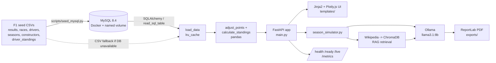

# F1 Points Calculator

Recalculate any Formula 1 season from 1950 onwards under a different points
system — modern, historical, or fully custom — and see how the championship
would have finished.


---

## Why this matters

Formula 1 has never had one points system. A win was worth 8 points in the
1950s, 9 in the 1980s, and is worth 25 today. Only the best *n* results counted
in some eras; every result counts now. Championships were therefore won and lost
under scoring rules that no longer exist — which makes cross-era comparison of
drivers, teams and title fights fundamentally unsound unless you normalise the
scoring first.

This app does that normalisation. It replays the actual finishing order of every
race in a season and re-scores it under whichever system you pick, so you can ask
concrete questions: would the 1988 title have been closer under modern points?
Does a consistent points-finisher beat a win-or-bin driver when the tail of the
scale gets longer? The answer is rarely a proportional rescale — the *shape* of a
season changes, because how often a driver scored matters differently depending
on how deep into the field the points run.

### It isn't just a rescale

Recalculating the 1988 season under the Modern points system:


And the race-by-race evolution of the 2021 Hamilton vs. Verstappen fight,
recalculated under the Modern system:


*(Both charts were generated from this repo's own data. The scoring rules behind
them live in [`scoring.py`](scoring.py), which the API and the standalone
[`adjusted_points.py`](adjusted_points.py) script both import — there is one
implementation, not a copy per entry point.)*

---

## Skills demonstrated

**Backend / API**
- **FastAPI** application with typed request models, auto-generated OpenAPI docs
  (`/api/docs`, `/api/redoc`), Jinja2 server-rendered pages and JSON APIs in one
  service.
- **Pydantic v2 validation layer** (`validators.py`): bounded season years
  (1950–2030), capped custom points arrays (max 30 entries) and driver-id
  selections (max 50), cross-field model validators (e.g. head-to-head rejects
  comparing a driver with themselves), and string sanitisation.
- **Custom ASGI middleware stack** (`middleware.py`): error handling, structured
  request logging, an in-memory per-client rate limiter (per-second burst,
  per-minute and per-hour buckets) and security headers.

**Data engineering**
- **pandas** transformation pipeline: multi-frame merges (results × drivers ×
  constructors × races), `groupby`/`cumsum` for cumulative standings, and modal
  aggregation to attribute each driver to their primary constructor in a season.
- **SQLAlchemy 2.0 Core + ORM** with dialect-aware engine construction — MySQL
  gets `pool_pre_ping` / `pool_recycle` to survive `wait_timeout` drops, SQLite
  gets `check_same_thread=False`, and `postgres://` / `mysql://` URLs are rewritten
  to the drivers actually installed (`psycopg3`, `PyMySQL`).
- **Idempotent ETL seeder** (`scripts/seed_mysql.py`): explicit per-column SQL
  types, pandas nullable `Int64` so missing values stay `NULL` instead of
  becoming floats, Kaggle's literal `\N` treated as NA, chunked `to_sql` inserts,
  post-load index creation, `--force` / `--tables` / `--data-dir` flags, and
  credential-redacted logging.
- **Graceful degradation**: if the database is unreachable or unseeded, the app
  logs a warning and falls back to the seed CSVs so it still boots.

**AI / ML**
- **Local LLM inference** via Ollama's HTTP `/api/generate` endpoint — no
  third-party API keys, no per-token cost.
- **RAG pipeline**: Wikipedia retrieval → **ChromaDB** vector collection →
  semantic query for season context → prompt augmentation with computed
  standings → generation.
- **Web scraping** with BeautifulSoup + Pillow to pull and process season imagery.
- **PDF report generation** with ReportLab, embedding Plotly figures rasterised
  through Kaleido.

**Frontend / visualisation**
- **Plotly** figures built server-side and serialised via `PlotlyJSONEncoder`,
  rehydrated by Plotly.js in the browser; Bootstrap 5 templates for the season,
  head-to-head and race-detail pages.

**Operations**
- **Docker Compose** for MySQL 8.4 (healthcheck, named volume, env-driven
  credentials) and for Ollama.
- **Kubernetes-style probes**: `/health`, `/ready` (returns **503** when not
  ready, not a cosmetic 200), `/live`, `/health/detailed`.
- **Prometheus observability**: `prometheus-fastapi-instrumentator` owns
  `/metrics` with route-template labels (so `/api/race/{race_id}` doesn't mint a
  time series per race), plus domain metrics in `metrics.py` — points-calculation
  latency, data-load cache hit rate, rate-limit rejections, Ollama call duration
  — and a custom lazy collector that evaluates health gauges at scrape time.
- **pytest** suite with `httpx`-backed `TestClient`, and 12-factor config via
  `.env` / `python-dotenv`. The scoring rules are covered by unit tests over
  hand-built frames plus era-level tests that reproduce Ergast's own `points`
  column exactly, row for row, for 1991–2002 and 2003–2009.
- **GitHub Actions CI** running ruff and the full suite on every push.

---

## Architecture



### Component layout

```
F1_points_application/
├── main.py                      # FastAPI app: routes and Plotly charts
├── scoring.py                   # Points rules, named systems, countback standings
├── db.py                        # SQLAlchemy engine/session + cache & race ORM models
├── health.py                    # /health, /ready, /live, /health/detailed probes
├── metrics.py                   # Prometheus metric definitions + health collector
├── middleware.py                # Error handling, logging, rate limiting, security headers
├── validators.py                # Pydantic request/response models and input limits
├── season_simulator.py          # Wikipedia RAG + Ollama + scraping + PDF report
├── adjusted_points.py           # Standalone CLI: re-score a season, write adjusted_results.csv
├── ruff.toml                    # Lint config (F + E), enforced by CI
├── .github/workflows/ci.yml     # Lint + tests on every push
├── scripts/
│   ├── fetch_data.py            # Verify / fetch / regenerate the datasets
│   ├── seed_mysql.py            # CSV -> MySQL seeder (idempotent)
│   └── migrate_sqlite_to_postgres.py
├── templates/                   # index.html, head_to_head.html, race_detail.html
├── tests/                       # pytest suite (test_points, test_api, test_scraping)
├── images/                      # Charts used in this README
├── docker-compose.yml           # MySQL 8.4
├── docker-compose.ollama.yml    # Ollama LLM server
├── .env.example                 # All configuration, documented
├── requirements.in              # Direct deps with intended ranges
├── requirements.txt             # Fully pinned lock (pip-compile output)
└── *.csv                        # Seed datasets (results, races, drivers, ...)
```

### Datasets

Six CSVs are tracked in git and are all the app needs: `results`, `races`,
`drivers`, `seasons`, `constructors`, `driver_standings`. They are the seed data
for `scripts/seed_mysql.py` and the fallback `load_data()` uses whenever the
database is unreachable, so a fresh clone runs without any download step.

Four more used to be tracked and no longer are, because nothing in the codebase
reads them — `lap_times.csv` (18 MB), `constructor_results.csv`,
`constructor_standings.csv`, `circuits.csv` — along with `adjusted_results.csv`,
which is *output* from `adjusted_points.py` rather than input, and `database.db`.

```bash
python scripts/fetch_data.py                     # what's present, what isn't
python scripts/fetch_data.py --check             # exit 1 if a required CSV is bad
python scripts/fetch_data.py --fetch-optional    # pull the bulk CSVs from Kaggle
python scripts/fetch_data.py --regenerate-adjusted
```

Upstream is the [Kaggle mirror of the Ergast
database](https://www.kaggle.com/datasets/rohanrao/formula-1-world-championship-1950-2020);
Ergast itself was retired at the end of 2024.

> **Note on repository size.** These files were untracked going forward with
> `git rm --cached`; **they are still present in the git history**, so a full
> `git clone` still transfers roughly 24 MB of them. Removing them properly means
> rewriting history, which would break every existing clone and fork, so it has
> not been done. `git clone --depth 1` avoids the cost if you only want the code.

### Data models

**Seeded F1 tables** — created by `scripts/seed_mysql.py` from the CSVs; these are
what every endpoint reads. Indexed columns are marked `[idx]`.

| Table | Key columns | Indexes |
|---|---|---|
| `results` | `resultId`, `raceId`, `driverId`, `constructorId`, `grid`, `position`, `positionOrder`, `points`, `laps`, `milliseconds`, `fastestLapTime`, `fastestLapSpeed`, `statusId` | `resultId`, `raceId`, `driverId`, `constructorId` |
| `races` | `raceId`, `year`, `round`, `circuitId`, `name`, `date`, plus FP/quali/sprint session dates | `raceId`, `year`, `circuitId` |
| `drivers` | `driverId`, `driverRef`, `code`, `forename`, `surname`, `dob`, `nationality` | `driverId` |
| `constructors` | `constructorId`, `constructorRef`, `name`, `nationality` | `constructorId` |
| `seasons` | `year`, `url` | `year` |
| `driver_standings` | `driverStandingsId`, `raceId`, `driverId`, `points`, `position`, `wins` | `driverStandingsId`, `raceId`, `driverId` |

**Application tables** — SQLAlchemy ORM models in `db.py`, created by `init_db()`
at startup:

| Model | Table | Purpose |
|---|---|---|
| `HeadToHeadCache` | `head_to_head_cache` | Cached JSON payloads for driver-vs-driver comparisons, keyed by `driver1_id`, `driver2_id`, `season`, `mode` |
| `Race` | `races_db` | Race lookup cache for the race list/detail pages (`raceId` unique, `year` indexed) |
| `RaceTelemetry` | `race_telemetry` | Stored telemetry payloads per race |

`init_db()` also handles a schema migration: a legacy `races_db` without a `year`
column is dropped and recreated, since `create_all()` cannot add columns and the
table is a rebuildable cache.

**Points-system models** — served by `GET /api/points-systems`:

| Key | Name | Scale | Modifiers |
|---|---|---|---|
| `modern` | Modern with fastest lap (2019–2024) | 25, 18, 15, 12, 10, 8, 6, 4, 2, 1 | +1 for fastest lap if classified in the top ten; sprint payouts defined but no sprint dataset ships |
| `modern_no_fl` | Modern (2010–2018) | 25, 18, 15, 12, 10, 8, 6, 4, 2, 1 | No fastest-lap point. 2014 Abu Dhabi's double points are not modelled |
| `points_2003` | Eight-scorer era (2003–2009) | 10, 8, 6, 5, 4, 3, 2, 1 | First system to pay down to P8 |
| `classic` | Classic (1991–2002) | 10, 6, 4, 3, 2, 1 | Every round counts |
| `pre_1991` | Pre-1991 (1961–1990) | 9, 6, 4, 3, 2, 1 | Dropped scores (best N results) are **not** modelled |
| `custom` | Custom | Any list you supply (up to 30 positions) | Positions only — no fastest-lap or sprint points |

Every entry carries its exact range and modifiers because a points array alone
does not describe a season: 2010 and 2019 pay the same 25/18/15 and only one of
them has a fastest-lap point. Sending no `points_system` means "score it the
modern way, modifiers included"; sending an array means "these positions, and
nothing else".

**AI models**

| Role | Model / component | Where |
|---|---|---|
| Text generation | `llama3.1:8b` via Ollama — fixed in code as `FIXED_OLLAMA_MODEL`, not user-selectable from the UI | `main.py`, called through `POST {OLLAMA_BASE_URL}/api/generate` |
| Vector store + embeddings | ChromaDB in-memory client, collection `f1_seasons`, using Chroma's default embedding function | `season_simulator.py` |
| Retrieval corpus | Wikipedia season pages (`wikipedia-api`); the page summary is stored as a document in the Chroma collection and queried for context | `season_simulator.py` |
| Optional telemetry source | `fastf1` for qualifying-gap data in head-to-head (off by default) | `main.py`, `ENABLE_FASTF1_QUALI_GAP` |

---

## How it works

**1. Data load.** `load_data()` in `main.py` reads the six datasets
(`results`, `races`, `drivers`, `seasons`, `constructors`, `driver_standings`)
out of the configured database with `pd.read_sql_table`, and is wrapped in
`lru_cache(maxsize=1)` so the frames are loaded once per process. If any table
is missing or empty the loader raises, the exception is caught, a warning is
logged, and the same six frames are read from the seed CSVs instead — the app
always boots.

**2. Re-scoring.** `scoring.adjust_points(results_df, rules, races=...)` copies
the results frame and awards the *i*-th value of the chosen scale to entrants
**classified** in position *i*. Classification is read from `positionText`, which
is numeric only for cars that finished — `positionOrder` is Ergast's sort key and
every entrant has one, retirements included. On top of the positional scale it
applies the fastest-lap point, sprint payouts, half points and shared-drive
splitting; see [Scoring model and known limitations](#scoring-model-and-known-limitations).
This operates on the real finishing order of every race ever run, so a 6-deep
1950s scale and a 10-deep modern scale produce genuinely different championships
rather than a linear rescale.

**3. Enrichment.** The adjusted results are merged with `drivers` (names),
`constructors` (team name) and `races` (`year`, race name, `round`), producing
one tidy frame keyed by driver, constructor and race.

**4. Standings.** `calculate_standings()` filters to the requested season, sums
`adjusted_points` per driver, and orders them by points and then by FIA
countback — most wins, then most second places, and so on down to P10 — so a tie
is resolved by a rule rather than by whatever order the `groupby` emitted.
Each driver is then attributed to their most frequent constructor that season
(modal count of appearances), so mid-season team changes don't split a driver's
row.

**5. Charts.** Four Plotly figures are built server-side and returned as JSON in
the same response: the **title fight** (drivers within 10% of the champion, or
the runner-up if nobody qualifies), **cumulative points** race by race,
**points distribution** across the field, and **constructors' cumulative
points**. The browser rehydrates them with Plotly.js.

**6. Other views.** `/head-to-head` compares two drivers across a season (with
Redis or database-backed caching, and optional `fastf1` qualifying gaps);
`/race-detail` drills into a single race's results.

**7. AI season report.** `POST /api/simulate-season` repeats steps 2–5, then
hands the standings and chart JSON to `season_simulator.py`, which fetches the
season's Wikipedia page, stores it in the ChromaDB `f1_seasons` collection,
queries it for relevant context, scrapes up to five season images, prompts
`llama3.1:8b` through Ollama's `/api/generate`, and assembles a ReportLab PDF
(summary, standings table, rasterised charts, images) written to `exports/` and
streamed back as a file download. Expect roughly 30–60 seconds.

**8. Cross-cutting.** Every request passes through the middleware stack (error
handling → logging → rate limiting → security headers), and per-route metrics
are recorded for the Prometheus scrape at `/metrics`.

---

## Scoring model and known limitations

Re-scoring a season is not just "look up the finishing position in an array".
Formula 1's rules carry modifiers that change championship totals, and a few
that this app deliberately does not model. Everything below is implemented in
[`scoring.py`](scoring.py) and covered by [`tests/test_points.py`](tests/test_points.py).

### What is modelled

| Rule | How |
|---|---|
| **Only classified finishers score** | Points are awarded on `positionText`, which is numeric only for cars that were classified. `positionOrder` is Ergast's sort key and *every* entrant gets one — 338 rows in this dataset have `positionOrder ≤ 10` with a null `position` (1957 Monaco, P7 with an engine failure, among them) |
| **Retirements, disqualifications, non-starters** | `R`, `D`, `E`, `W`, `F`, `N` in `positionText` all score zero. A disqualification does not promote the cars behind it; the published classification is scored as published |
| **Shared drives** | In the 1950s a driver could hand his car to a team-mate and both were classified in the same position — the 1955 Argentine GP has three cars at P2 and three at P3. That position's points are split between them, as the FIA did |
| **Fastest lap** | One point where the system defines it (2019–2024), only if the driver was classified in the top ten. Ergast records it as `rank == 1`, a column populated from 2004 onwards |
| **Half points** | The six races stopped before 75% distance: 1975 Spain, 1975 Austria, 1984 Monaco, 1991 Australia, 2009 Malaysia, 2021 Belgium. There is no scheduled-lap-count column in the data, so this is an explicit list rather than a derived rule |
| **Tie-breaks** | FIA countback: points, then count of wins, then seconds, then thirds, down to P10 |
| **Sprint races** | The scoring supports them and the modern system declares the 8-7-6-5-4-3-2-1 payout — but **no sprint dataset ships with this repo** (see below) |

### What is not modelled

- **Sprint results are missing from the data.** `races.csv` has a `sprint_date`
  for 18 rounds, but there is no sprint results table to score. 2021–2024 totals
  are therefore short by the sprint points those drivers actually scored.
  `scoring.adjust_points()` accepts a `sprint_results` frame and will score it if
  you supply one.
- **Dropped scores.** From 1950 to 1990 only a driver's best *n* results counted
  towards the title, and *n* varied year to year. Every round is counted here, so
  pre-1991 totals are the raw ones. This is why 1988 comes out Prost 105, Senna
  94 — the correct *raw* totals — while the championship was actually Senna's
  under best-11.
- **2014's double-points finale.** Abu Dhabi 2014 paid double. Not applied.
- **The 1950s fastest-lap point**, which was shared between drivers who set
  identical times, and the Indianapolis 500 rounds counted towards the
  championship from 1950 to 1960.
- **Ineligible entrants.** A handful of races mixed in cars not eligible for
  championship points — Formula 2 entries in the 1960s German GPs, most notably.
  Seven rows across 1961–1990 disagree with the official points column for this
  reason.
- **Constructor championship rules**, which have their own history of counting
  only the best-placed car per team.

### How closely this tracks reality

The test suite scores whole eras of `results.csv` and compares against Ergast's
own `points` column, which is the figure the FIA awarded:

| Era | Rows | Disagreements |
|---|---|---|
| 1991–2002 | 4,817 | **0** |
| 2003–2009 | 2,534 | **0** |
| 2010–2018 | 3,877 | 10 — all of them the 2014 double-points finale |
| 2019–2024 | 2,559 | 1 — the 2024 Monaco GP has no fastest-lap data in the dataset |
| 1961–1990 | 10,742 | 7 — ineligible F2 entries |

---

## How to run

### Prerequisites

- Python 3.13 — the interpreter `requirements.txt` is locked for, and the one CI runs
- Docker + Docker Compose (for MySQL; also the easiest way to run Ollama)
- Optional: Redis, if you want the head-to-head response cache
- Optional: Ollama with `llama3.1:8b` pulled, for the AI season report

### 1. Install dependencies

```bash
pip install -r requirements.txt
```

`requirements.txt` is a fully pinned lock — every version exact, transitive
dependencies included. `requirements.in` holds the direct dependencies with the
ranges that are actually intended; edit that and regenerate:

```bash
pip install pip-tools
pip-compile requirements.in -o requirements.txt
```

Nothing floats, and CI demonstrated why on its first run: a newer FastAPI renamed
router internals, `prometheus-fastapi-instrumentator` broke against it, and every
health-probe test failed on a commit that changed no application code.

### 2. Start and seed the database

```bash
cp .env.example .env              # then set the CHANGE_ME_* passwords in it
docker compose up -d              # mysql:8.4, container f1-mysql, volume f1_mysql_data
python scripts/seed_mysql.py      # loads the CSVs into MySQL (one-off)
```

The `.env` step comes first and is not optional: `docker-compose.yml` declares
its credentials as `${MYSQL_PASSWORD:?...}` with no fallback, so compose stops
with a named-variable error rather than starting a database on a password
published in this repository. The container publishes on `127.0.0.1:3306`, not
`0.0.0.0` — set `MYSQL_BIND_HOST` if you genuinely need it reachable off-host.

The seeder is idempotent — it skips tables that already hold rows. Useful flags:

```bash
python scripts/seed_mysql.py --force              # drop and reload every table
python scripts/seed_mysql.py --tables results races
python scripts/seed_mysql.py --data-dir /path/to/csvs
```

Data lives in the `f1_mysql_data` Docker volume, so it survives
`docker compose down` and container rebuilds. `docker compose down -v` deletes it.

The app runs without MySQL — it falls back to reading the CSVs directly — but the
database is the intended path.

### 3. (Optional) Set up Ollama for the AI report

The model is fixed to `llama3.1:8b`.

Docker:

```bash
docker compose -f docker-compose.ollama.yml up -d
docker exec -it ollama ollama pull llama3.1:8b
curl http://localhost:11434/api/tags        # verify
```

Local install ([ollama.com/download](https://ollama.com/download)):

```bash
ollama pull llama3.1:8b
curl http://localhost:11434/api/tags
```

### 4. Run the app

```bash
python main.py                                        # serves on 0.0.0.0:8000
```

or with reload during development:

```bash
uvicorn main:app --reload --host 0.0.0.0 --port 8000
```

Then open <http://localhost:8000>. API docs are at
<http://localhost:8000/api/docs>.

To use a different port, run the `uvicorn` command with `--port 8001` (the
`python main.py` entrypoint hardcodes port 8000).

### 5. Run the tests

```bash
python scripts/fetch_data.py --check   # confirm the seed CSVs are intact
ruff check .                           # config in ruff.toml
pytest                                 # ~2 min; scores whole eras of results.csv
```

These are exactly the three commands CI runs — see
[`.github/workflows/ci.yml`](.github/workflows/ci.yml), which fires on every push
and pull request. There is deliberately no MySQL
service in CI: `load_data()` falls back to the seed CSVs when the database is
unreachable, and that fallback is the path a fresh clone actually takes, so
testing against it is testing what people run. A second job imports `main` with
no `.env` and no database to catch import-time configuration breakage.

### Using the app

1. Pick a season from the dropdown.
2. Pick a points system — Modern, Classic, Pre-1991, or Custom
   (e.g. `10, 8, 6, 4, 3, 2, 1`).
3. Click **Calculate Standings** for the recalculated table and charts.
4. Optionally click **Simulate Season** to generate the AI PDF report (30–60s;
   requires a reachable Ollama server).

### API endpoints

| Method | Path | Description |
|---|---|---|
| `GET` | `/` | Main application page |
| `GET` | `/head-to-head` | Head-to-head comparison page |
| `GET` | `/race-detail` | Race detail page |
| `GET` | `/api/seasons` | All available seasons |
| `GET` | `/api/points-systems` | Predefined points systems |
| `POST` | `/api/calculate-standings` | Recalculated standings + charts for a season |
| `GET` | `/api/races?season=` | Races in a season |
| `POST` | `/api/race-results` | Detailed results for one race |
| `GET` | `/api/drivers` | Drivers, optionally filtered by season |
| `GET` | `/api/head-to-head` | Season head-to-head stats for two drivers |
| `GET` | `/api/h2h-wikipedia` | Offline driver summaries for a head-to-head |
| `GET` | `/api/race/{race_id}` | Race detail by race ID |
| `POST` | `/api/simulate-season` | AI season report, returned as a PDF |
| `GET` | `/health`, `/ready`, `/live`, `/health/detailed` | Health and readiness probes |
| `GET` | `/metrics` | Prometheus exposition |
| `GET` | `/api/docs`, `/api/redoc`, `/api/openapi.json` | API documentation |

```python
import requests

# Available seasons
requests.get("http://localhost:8000/api/seasons").json()

# 2023 under the default Modern points system
requests.post("http://localhost:8000/api/calculate-standings",
              json={"season_year": 2023})

# 2023 under a custom scale
requests.post("http://localhost:8000/api/calculate-standings",
              json={"season_year": 2023, "points_system": [10, 8, 6, 4, 3, 2, 1]})
```

### Configuration

Every variable has a working default for local development. Copy `.env.example`
to `.env` and adjust.

| Variable | Default | Description |
|---|---|---|
| `ENVIRONMENT` | `development` | `development`, `staging`, or `production` |
| `API_VERSION` | `1.0.0` | Version reported in the OpenAPI schema |
| `APP_VERSION` | `1.0.0` | Version reported by the health endpoints |
| `DATABASE_URL` | `sqlite:///cache.db` | Connection string. `.env.example` sets a `mysql+pymysql://` URL with a placeholder password; SQLite and Postgres/Supabase URLs also work |
| `CACHE_DB_URL` | — | Fallback used if `DATABASE_URL` is unset |
| `MYSQL_DATABASE` / `MYSQL_USER` / `MYSQL_PASSWORD` | *(no default)* | Credentials `docker-compose.yml` creates the database with — compose refuses to start until they are set; keep in sync with `DATABASE_URL` |
| `MYSQL_ROOT_PASSWORD` | *(no default)* | MySQL root password inside the container |
| `MYSQL_PORT` | `3306` | Host port the MySQL container publishes |
| `MYSQL_BIND_HOST` | `127.0.0.1` | Interface the MySQL port is published on |
| `DATA_DIR` | repo root | Directory the seeder reads the CSVs from |
| `REDIS_URL` | `redis://localhost:6379/0` | Optional Redis cache for head-to-head responses |
| `H2H_CACHE_TTL_SECONDS` | `3600` | Age at which a cached head-to-head answer is refused, in both Redis and SQL |
| `ENABLE_RATE_LIMITING` | `true` | Toggle the in-memory rate limiter |
| `RATE_LIMIT_PER_MINUTE` | `60` | Requests per minute per client |
| `RATE_LIMIT_PER_HOUR` | `1000` | Requests per hour per client |
| `RATE_LIMIT_BURST` | `10` | Max requests per second per client |
| `TRUSTED_PROXIES` | *(empty)* | Comma-separated IPs/CIDRs whose `X-Forwarded-For` the rate limiter will believe. Empty means the header is ignored entirely |
| `CORS_ORIGINS` | `*` | Comma-separated allowed origins. Credentials are only enabled for non-wildcard origins |
| `OLLAMA_BASE_URL` | `http://localhost:11434` | Ollama server used by `/api/simulate-season` |
| `ENABLE_FASTF1_QUALI_GAP` | `false` | Opt-in: fetch per-driver-pair qualifying telemetry via `fastf1` for `/api/head-to-head`. Adds external network calls and can slow responses |

### Troubleshooting

- **`Database load failed … falling back to seed CSV files`** — MySQL is down or
  unseeded. Check `docker compose ps` (the service should be `healthy`), confirm
  `DATABASE_URL` in `.env` matches the compose credentials, and run
  `python scripts/seed_mysql.py`.
- **`Can't connect to MySQL server on 'localhost'`** — something else is using
  port 3306. Set `MYSQL_PORT=3307` in `.env`, update the port in `DATABASE_URL`
  to match, and re-run `docker compose up -d`.
- **`cryptography package is required for sha256_password`** — install the full
  requirements; PyMySQL needs `cryptography` for MySQL 8's default auth plugin.
- **Ollama connection refused** — the server isn't running or `OLLAMA_BASE_URL`
  is wrong. Verify with `curl http://localhost:11434/api/tags`. The first
  generation is slow while the model warms up.
- **No images in the PDF** — normal for older seasons where Wikipedia has limited
  imagery.
- **Port 8000 already in use** — run via
  `uvicorn main:app --port 8001` instead of `python main.py`.

See [`SETUP_AI_FEATURE.md`](SETUP_AI_FEATURE.md) for more detail on the AI
season-report feature.

---

## Deployment

[`.github/workflows/cd.yml`](.github/workflows/cd.yml) deploys the
[`Dockerfile`](Dockerfile) to [Cloud Run](https://cloud.google.com/run)
whenever [`ci.yml`](.github/workflows/ci.yml) finishes successfully on `main`
— never on a failing commit. The container runs with no `DATABASE_URL`, the
same seed-CSV fallback path CI tests, so there is no Cloud SQL instance to
provision or pay for. `--min-instances=0` scales to zero between requests
(free at low traffic) and `--max-instances=2` caps the ceiling so a traffic
spike can't run past the free tier unnoticed.

One-time setup, before the workflow will run:

1. Create (or pick) a GCP project and enable billing — required by Cloud Run
   even though usage stays free at this app's traffic. Enable the Cloud Run
   and Artifact Registry APIs.
2. Create the Artifact Registry repository the workflow pushes to:
   ```bash
   gcloud artifacts repositories create f1-points \
     --repository-format=docker --location=<GCP_REGION>
   ```
3. Create a deploy service account and key:
   ```bash
   gcloud iam service-accounts create f1-points-deployer
   gcloud projects add-iam-policy-binding <GCP_PROJECT_ID> \
     --member="serviceAccount:f1-points-deployer@<GCP_PROJECT_ID>.iam.gserviceaccount.com" \
     --role="roles/run.admin"
   gcloud projects add-iam-policy-binding <GCP_PROJECT_ID> \
     --member="serviceAccount:f1-points-deployer@<GCP_PROJECT_ID>.iam.gserviceaccount.com" \
     --role="roles/artifactregistry.writer"
   gcloud projects add-iam-policy-binding <GCP_PROJECT_ID> \
     --member="serviceAccount:f1-points-deployer@<GCP_PROJECT_ID>.iam.gserviceaccount.com" \
     --role="roles/iam.serviceAccountUser"
   gcloud iam service-accounts keys create key.json \
     --iam-account=f1-points-deployer@<GCP_PROJECT_ID>.iam.gserviceaccount.com
   ```
4. In the GitHub repo settings (Settings → Secrets and variables → Actions):
   - Secret `GCP_SA_KEY` — the full contents of `key.json`. Delete the local
     file after pasting it in.
   - Variable `GCP_PROJECT_ID` — the GCP project ID.
   - Variable `GCP_REGION` — e.g. `us-central1`.

After that, every push to `main` that passes CI deploys automatically; no
further manual steps.

---

## License

MIT.

## Contributing

Issues, feature requests and pull requests are welcome.
