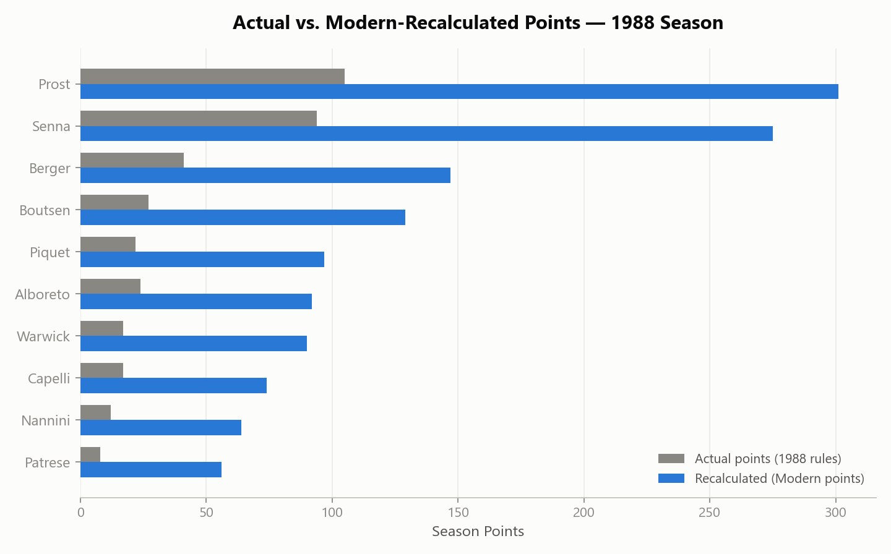
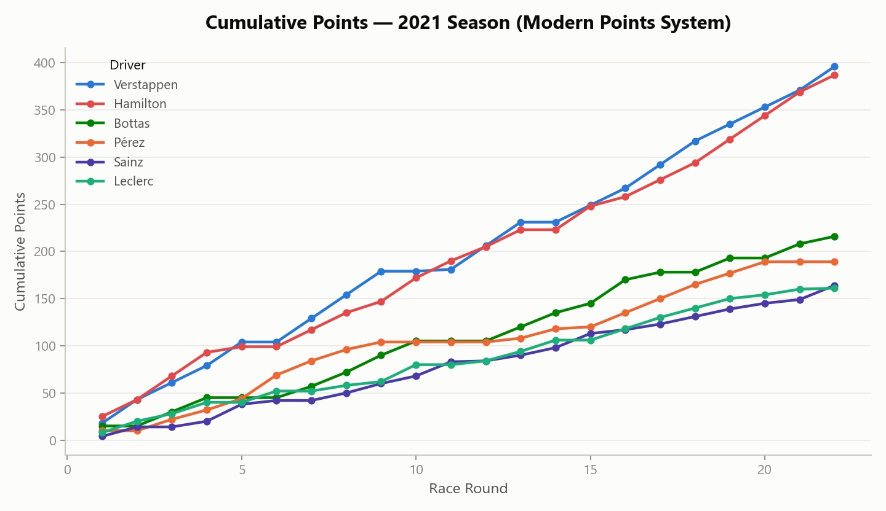
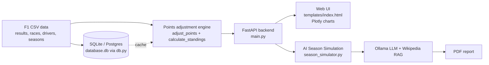

# F1 Points Calculator

**What if F1 had always scored points the way it does today?**

## Tech Stack


Formula 1's points system has changed many times — a win was worth 8 points in
the 1950s, 9 in the 1980s, and is worth 25 today. Drivers' championships were
won and lost under rules that no longer apply. This app recalculates any
historical F1 season (1950–2024) under a points system of your choosing —
Modern, Classic, Pre-1991, or a fully custom scale — and shows you how the
standings would have looked.

It's a full-stack web app: FastAPI backend over historical F1 results data,
an interactive frontend with Plotly charts, and an optional AI-generated
season report (via a local Ollama model) that writes up the recalculated
season with historical context pulled from Wikipedia.

### Example: it isn't just a rescale

Recalculating the 1988 season with the Modern points system doesn't just
scale everyone up evenly — the whole shape of the season changes because
who scored *how often* matters differently across systems:



And for any season, the app can trace how a title fight evolved race by
race — here's the 2021 Hamilton vs. Verstappen battle, recalculated under
the Modern points system:



*(Both charts above were generated straight from this repo's own data —
see [`adjusted_points.py`](adjusted_points.py) / [`adjusted_points.ipynb`](adjusted_points.ipynb) for the
recalculation logic that also powers the live app in `main.py`.)*

### How data flows through the app



## Features

- **Season Selection**: Choose from any F1 season (1950-2024)
- **Multiple Points Systems**: 
  - Modern (2010-2024): 25, 18, 15, 12, 10, 8, 6, 4, 2, 1
  - Classic (1991-2002): 10, 6, 4, 3, 2, 1
  - Pre-1991: 9, 6, 4, 3, 2, 1
  - Custom: Define your own points system
- **Interactive Visualizations**: 
  - Cumulative points chart showing how drivers' points evolved throughout the season
  - Points distribution bar chart for the top 15 drivers
- **AI-Powered Season Simulation** (NEW!):
   - Generate comprehensive season reports with local Ollama
  - RAG (Retrieval Augmented Generation) using Wikipedia data
  - Web scraping for season images with Beautiful Soup
  - Export detailed PDF reports with charts, images, and AI analysis
- **Modern UI**: Responsive design with Bootstrap and custom styling
- **Real-time Calculations**: Fast API responses with Plotly charts

## Installation

1. **Clone or download the project files**

2. **Install Python dependencies**:
   ```bash
   pip install -r requirements.txt
   ```

3. **Set up Ollama (for AI Season Simulation)**:
    - Model used by this app is fixed to: `llama3.1:8b`
    - Local install option:
       - Install Ollama from https://ollama.com/download
       - Pull model: `ollama pull llama3.1:8b`
       - Verify server: `curl http://localhost:11434/api/tags`
    - Docker option:
       - Run: `docker compose -f docker-compose.ollama.yml up -d`
       - Pull model: `docker exec -it ollama ollama pull llama3.1:8b`
       - Verify server: `curl http://localhost:11434/api/tags`
    - Optional env config:
       - `OLLAMA_BASE_URL=http://localhost:11434`

4. **Ensure you have the required CSV files**:
   - `results.csv` - Race results data
   - `races.csv` - Race information
   - `drivers.csv` - Driver information
   - `seasons.csv` - Available seasons

## Usage

1. **Start the application**:
   ```bash
   python main.py
   ```

2. **Open your web browser** and navigate to:
   ```
   http://localhost:8000
   ```

3. **Select a season** from the dropdown menu

4. **Choose a points system**:
   - Modern (default): Current F1 points system
   - Classic: Points system used from 1991-2002
   - Pre-1991: Points system used before 1991
   - Custom: Enter your own points (e.g., "10, 8, 6, 4, 3, 2, 1")

5. **Click "Calculate Standings"** to see the results

6. **Generate AI Season Report** (Optional):
   - Click "Simulate Season" button
   - No model selection is required (app uses `llama3.1:8b`)
   - Wait 30-60 seconds for the AI to generate a comprehensive report
   - PDF will download automatically with:
     - AI-generated season summary and analysis
     - Historical context from Wikipedia (RAG)
     - All standings and statistics
     - Interactive charts
     - Season images from web scraping

## API Endpoints

- `GET /` - Main application page
- `GET /head-to-head` - Head-to-head driver comparison page
- `GET /race-detail` - Race detail page
- `GET /api/seasons` - Get all available seasons
- `POST /api/calculate-standings` - Calculate standings for a season with specified points system
- `GET /api/points-systems` - Get predefined points systems
- `GET /api/races` - Get all races for a season
- `POST /api/race-results` - Get detailed results for a specific race
- `GET /api/drivers` - Get drivers, optionally filtered by season
- `GET /api/head-to-head` - Season head-to-head stats for two drivers
- `GET /api/h2h-wikipedia` - Offline driver summary for a head-to-head comparison
- `GET /api/race/{race_id}` - Race detail and results by race ID
- `POST /api/simulate-season` - Generate AI-powered season simulation PDF (uses Ollama)
- `GET /health`, `/ready`, `/live`, `/health/detailed`, `/metrics` - Health/readiness probes and metrics

## Environment Variables

All variables have sensible defaults for local development; set these in a `.env` file or your deployment environment for production.

| Variable | Default | Description |
|---|---|---|
| `ENVIRONMENT` | `development` | `development`, `staging`, or `production` |
| `API_VERSION` | `1.0.0` | Reported in the API docs/OpenAPI schema |
| `DATABASE_URL` | `sqlite:///cache.db` | SQLite or Postgres (Supabase) connection string |
| `CACHE_DB_URL` | - | Fallback for `DATABASE_URL` |
| `REDIS_URL` | `redis://localhost:6379/0` | Optional Redis cache for head-to-head responses |
| `ENABLE_RATE_LIMITING` | `true` | Toggle the in-memory rate limiter |
| `RATE_LIMIT_PER_MINUTE` | `60` | Requests per minute per client |
| `RATE_LIMIT_PER_HOUR` | `1000` | Requests per hour per client |
| `RATE_LIMIT_BURST` | `10` | Max requests per second per client |
| `CORS_ORIGINS` | `*` | Comma-separated allowed origins. Credentials are only enabled on non-wildcard origins |
| `OLLAMA_BASE_URL` | `http://localhost:11434` | Local Ollama server used by `/api/simulate-season` |
| `ENABLE_FASTF1_QUALI_GAP` | `false` | Opt-in: fetch per-driver-pair qualifying telemetry via the `fastf1` package for `/api/head-to-head`. Adds real network calls to an external timing API and can slow down responses |

## Example API Usage

```python
import requests

# Get available seasons
seasons = requests.get("http://localhost:8000/api/seasons").json()

# Calculate standings for 2023 with modern points
response = requests.post("http://localhost:8000/api/calculate-standings", 
                        json={"season_year": 2023})

# Calculate standings with custom points
response = requests.post("http://localhost:8000/api/calculate-standings", 
                        json={
                            "season_year": 2023,
                            "points_system": [10, 8, 6, 4, 3, 2, 1]
                        })
```

## Data Sources

The application uses historical F1 data from CSV files containing:
- Race results and positions
- Driver information
- Race details and seasons
- Circuit information

## Technical Stack

- **Backend**: FastAPI (Python)
- **Frontend**: HTML5, CSS3, JavaScript
- **Styling**: Bootstrap 5, Custom CSS
- **Visualizations**: Plotly.js
- **Data Processing**: Pandas
- **AI/ML**: Ollama, ChromaDB (Vector Database), RAG
- **Web Scraping**: Beautiful Soup, Requests, Wikipedia API
- **PDF Generation**: ReportLab, Kaleido
- **Icons**: Font Awesome

## Customization

### Adding New Points Systems

To add new predefined points systems, modify the `get_points_systems()` function in `main.py`:

```python
@app.get("/api/points-systems")
async def get_points_systems():
    return {
        "points_systems": {
            "modern": {"name": "Modern (2010-2024)", "points": [25, 18, 15, 12, 10, 8, 6, 4, 2, 1]},
            "classic": {"name": "Classic (1991-2002)", "points": [10, 6, 4, 3, 2, 1]},
            "pre_1991": {"name": "Pre-1991", "points": [9, 6, 4, 3, 2, 1]},
            "your_system": {"name": "Your System", "points": [15, 12, 10, 8, 6, 4, 2, 1]},
            "custom": {"name": "Custom", "points": []}
        }
    }
```

### Modifying Visualizations

The charts are created using Plotly. You can modify the chart functions in `main.py`:
- `create_cumulative_points_chart()` - Cumulative points over the season
- `create_points_distribution_chart()` - Final points distribution

## Troubleshooting

1. **Port already in use**: Change the port in `main.py`:
   ```python
   uvicorn.run(app, host="0.0.0.0", port=8001)
   ```

2. **Missing CSV files**: Ensure all required CSV files are in the project directory

3. **Dependencies issues**: Try updating pip and reinstalling requirements:
   ```bash
   python -m pip install --upgrade pip
   pip install -r requirements.txt
   ```

## License

This project is open source and available under the MIT License.

## Contributing

Feel free to submit issues, feature requests, or pull requests to improve the application.
